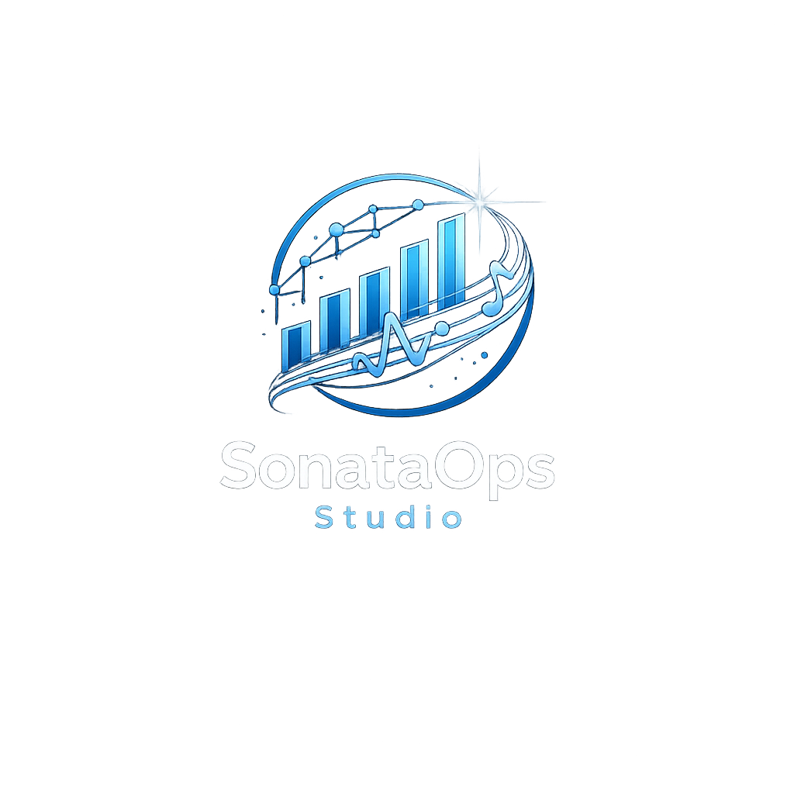
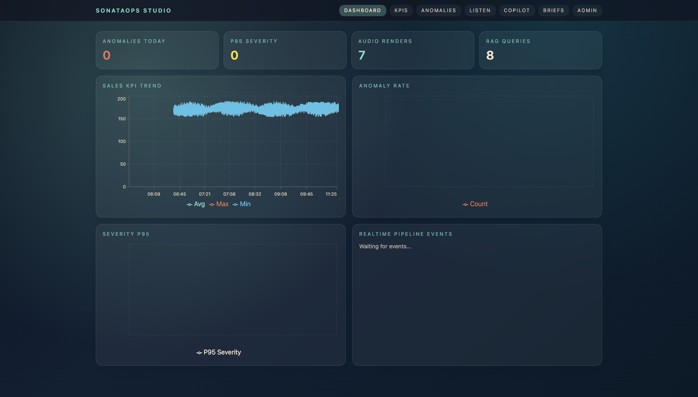
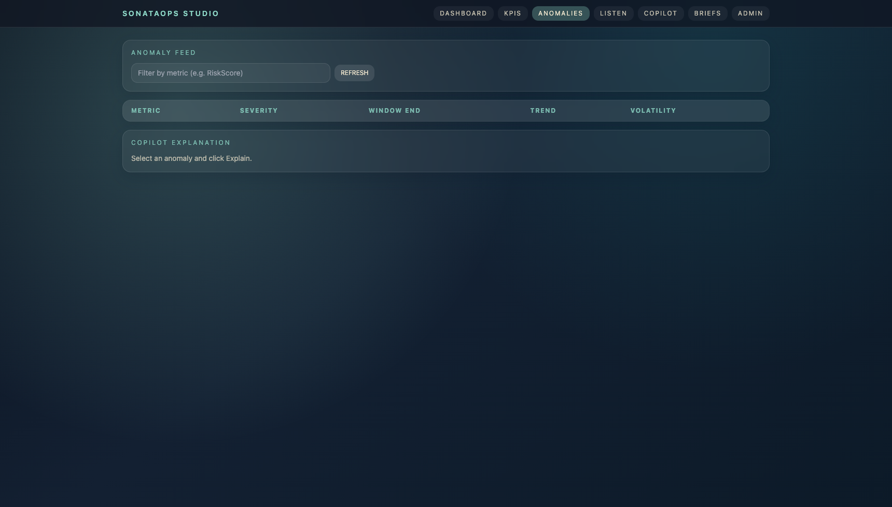
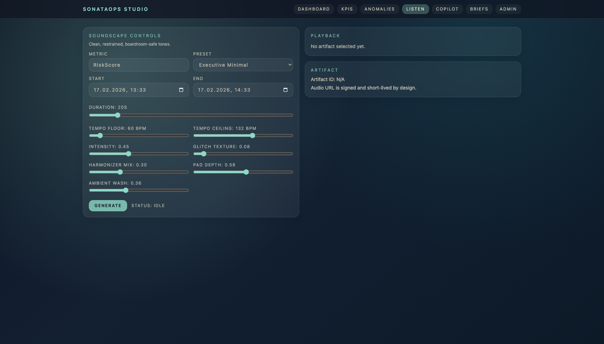
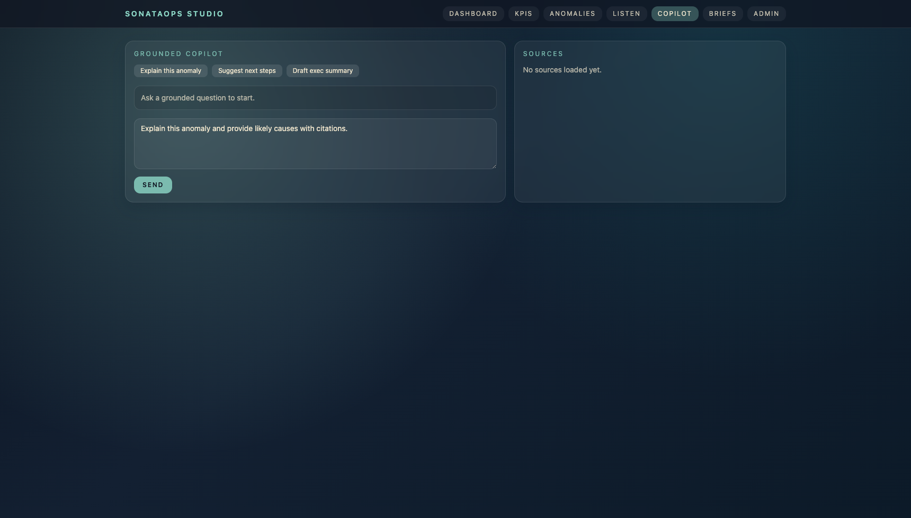
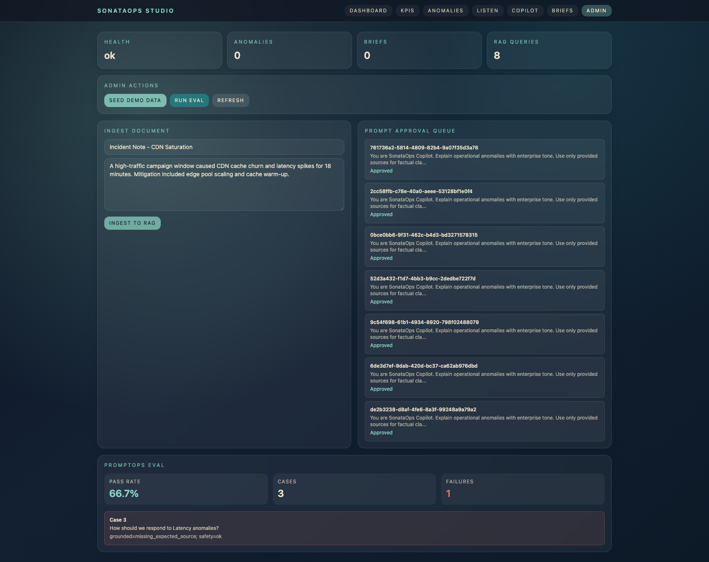

<p align="center">
  
</p>

# sonataops-studio

SonataOps Studio is an enterprise platform that turns KPI time-series into both dashboards and soundscapes, explains anomalies with RAG grounded in internal docs, and auto-generates C-level briefs with agents.

## About
- Product: Enterprise KPI intelligence platform (dashboards + soundscapes + grounded copilot + automated briefs)
- Repository: [https://github.com/WeAreTheArtMakers/SonataOpsStudio](https://github.com/WeAreTheArtMakers/SonataOpsStudio)
- Free provider: GitHub Pages
- Free-service deployment link: [https://wearetheartmakers.github.io/SonataOpsStudio/](https://wearetheartmakers.github.io/SonataOpsStudio/)
- Full-stack free-tier deployment guide: `docs/ONLINE_DEPLOYMENT_FREE_TIER.md`

## What This Demo Shows
- KPI ingestion into ClickHouse (OLAP) + Postgres (operational cache)
- Streaming anomaly detection with feature extraction
- Data sonification with SuperCollider -> WAV/MP3 artifacts in MinIO
- RAG copilot using LlamaIndex chunking + pgvector retrieval + pluggable LLM providers (Groq, z.ai, deterministic mock)
- Agent automation via n8n flows (incident narrator, anomaly correlator, executive brief generator)
- Enterprise observability with Prometheus, Grafana, OpenTelemetry, Jaeger
- Tenant-aware architecture with `workspace_id` and tenant-filtered vector search
- PromptOps approval gate for prompt + source package before LLM calls

## Screenshots






Regenerate locally with `make screenshots` (requires running frontend).

## Quickstart
1. Copy env template:
```bash
cp .env.example .env
```
2. Start stack:
```bash
docker compose up --build
```

Or start conflict-safe demo mode (auto-selects free host ports):
```bash
make listen-demo
```
3. Open apps:
- Frontend: [http://localhost:3000](http://localhost:3000)
- Backend API docs: [http://localhost:8000/docs](http://localhost:8000/docs)
- n8n: [http://localhost:5678](http://localhost:5678)
- MinIO Console: [http://localhost:9001](http://localhost:9001)
- Grafana: [http://localhost:3001](http://localhost:3001)
- Jaeger: [http://localhost:16686](http://localhost:16686)

4. Seed demo data:
```bash
curl -X POST http://localhost:8000/admin/seed-demo
```

## Demo Script
Use `docs/DEMO_SCRIPT.md`.

## Architecture (ASCII)
```text
                 +-----------------------+
                 |      Frontend         |
                 | Next.js + Recharts    |
                 +----------+------------+
                            |
                     REST + SSE/WebSocket
                            |
+---------------------------v----------------------------+
|                  FastAPI (API)                         |
|  KPI ingest, RAG, audio jobs, briefs, prompt approvals |
+--------+------------------+----------------+-----------+
         |                  |                |
         |                  |                +----------------------+
         |                  |                                       |
+--------v--------+  +------v------+  +-------------------+  +------v------+
|   Postgres 15   |  | ClickHouse  |  |      MinIO        |  |     n8n      |
| ops + pgvector  |  | raw + MVs   |  | WAV/MP3 artifacts |  | automations  |
+--------+--------+  +------+------+
         |                  |
         +---------+--------+
                   |
            +------v-------+
            | backend-worker|
            | anomaly + audio|
            | SuperCollider  |
            +------+--------+
                   |
         +---------v---------+
         | OTel Collector    |
         | -> Jaeger traces  |
         | -> Prom metrics   |
         +---------+---------+
                   |
           +-------v------+
           |   Grafana    |
           +--------------+
```

## RAG Flow
1. Docs are ingested through `POST /rag/ingest`.
2. LlamaIndex `SentenceSplitter` chunks text.
3. Deterministic or provider embeddings are stored in Postgres `pgvector` table (`workspace_id` scoped).
4. `POST /copilot/ask` retrieves top chunks with citations.
5. PromptOps approval gate checks prompt+sources package.
6. LLM answer is returned with confidence + source list.

## Sonification Flow
1. User requests render via `POST /audio/render`.
2. API enqueues an `audio_jobs` record (non-blocking).
3. Worker polls queue, pulls KPI window from ClickHouse, maps features to sonic curves.
4. Worker calls `sclang` (SuperCollider script generated per job) to render WAV.
5. Worker creates MP3 preview, uploads both to MinIO, writes metadata in Postgres.
6. Completion event is pushed to SSE/WebSocket stream.

See `docs/SONIFICATION_MAPPING.md` for detailed mappings.

## n8n Flows
Flow exports live in `n8n/flows`:
- `incident_narrator.json`
- `exec_brief_generator.json`
- `anomaly_correlator.json`

Import them in n8n UI and update webhook URLs if needed.

## Observability
- Prometheus scrapes backend and OTel collector metrics.
- Grafana dashboards JSON files are in `infra/grafana/dashboards`.
- OTel collector receives traces from backend API/worker.
- Jaeger UI shows end-to-end traces including DB, ClickHouse, MinIO, n8n webhook spans.

## Interview Talking Points
- **Dual-store design**: ClickHouse for high-volume analytics + Postgres for transactional workflows.
- **Tenant-aware RAG**: `workspace_id` in all key tables and retrieval filters, including pgvector documents.
- **PromptOps governance**: prompt/source package approval before outbound LLM call.
- **Async audio pipeline**: Postgres job queue + worker + signed MinIO URLs.
- **Enterprise observability**: OTel traces across API->DB->OLAP->automation->render path.
- **Quality gates**: RAG groundedness/safety evals with stored run history.

## Notes
- No paid dependency is required in demo mode. If `GROQ_API_KEY`/`ZAI_API_KEY` is missing, the deterministic mock LLM provider is used.
- Demo mode keeps auth open intentionally; see `docs/SECURITY_GOVERNANCE.md` for production hardening.
- For stable online full-stack hosting with free tiers, use Oracle Always Free VM + `docker-compose.cloud.yml` (`docs/ONLINE_DEPLOYMENT_FREE_TIER.md`).

Made with ❤️ WeAreTheArtMakers
